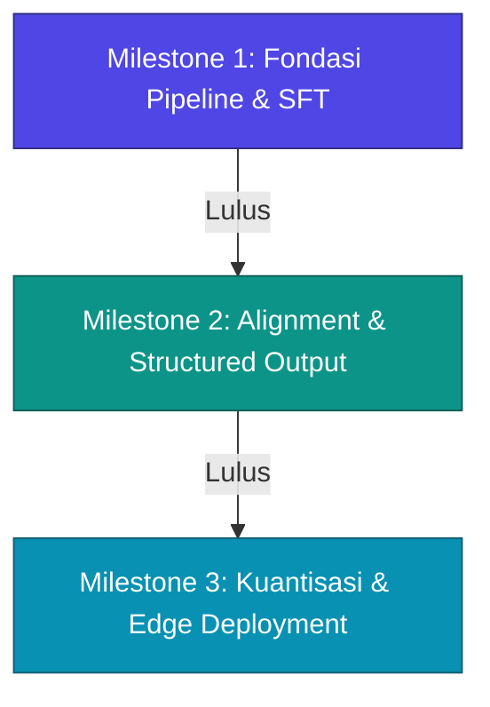

# Jalur Pembelajaran: Pembuatan Pipeline Fine-Tuning LLM
*(LLM Fine-Tuning Pipeline Learning Track)*

Selamat datang di repositori pembelajaran Syifa! Repositori ini dirancang khusus sebagai panduan terstruktur dan praktis untuk menguasai pembuatan pipeline *Fine-Tuning* LLM tingkat produksi (*production-grade*). 

Melalui tiga proyek bertahap di bawah ini, Syifa akan belajar mendesain pipeline data, melakukan pelatihan model yang efisien, mengoptimalkan bobot model, mengevaluasi hasil secara kuantitatif, hingga melakukan deployment di lingkungan lokal maupun cloud.

---

## 🎯 Target Kompetensi Utama
Setelah menyelesaikan seluruh kurikulum ini, Syifa diharapkan mampu:
1. **Data Engineering untuk LLM:** Mengolah, menyaring, dan memformat dataset mentah menjadi instruksi terstruktur (*Instruction/Alignment Tuning*).
2. **Efficient Fine-Tuning (PEFT/QLoRA):** Memahami dan mengonfigurasi hyperparameter pelatihan (LoRA alpha, rank, target modules) menggunakan hardware secara optimal.
3. **Experiment Tracking & Logging:** Menggunakan Weights & Biases (WandB) untuk memantau loss pelatihan secara real-time.
4. **Model Evaluation & Alignment:** Melakukan evaluasi kuantitatif otomatis pada LLM hasil training (misal dengan Ragas) dan memahami bias model.
5. **Model Optimization & Edge Deployment:** Melakukan kuantisasi model (*Post-Training Quantization*) dan membangun layanan inferensi berkecepatan tinggi (*serving*).

---

## 🗺️ Peta Jalan Kurikulum (3 Milestone Utama)



---

## 📚 Detail Kurikulum Proyek

### 🧠 MILESTONE 1: Specialized Biomedical LLM Assistant via PEFT (QLoRA)
**Fokus Belajar:** Fondasi pembuatan pipeline fine-tuning, persiapan data latih medis, serta pemantauan eksperimen.

#### 1. Deskripsi & Tujuan Pembelajaran
Melatih model berskala menengah agar mengenali domain khusus (biomedis/medis). Syifa akan belajar membangun pipeline SFT dari nol, menyaring data akademik yang kompleks, meminimalkan halusinasi melalui dataset berkualitas, dan menyajikan model hasil latihan.

#### 2. Tech Stack & Tools
* **Base Model:** `MedGemma-1.5` (spesialisasi klinis), `Gemma-4-12B`, atau `Llama-4-Scout`.
* **Framework Pelatihan:** PyTorch, Hugging Face (Transformers, TRL, PEFT), **Unsloth** (untuk akselerasi QLoRA 4-bit secara efisien).
* **Dataset:** `PubMedQA` & `MedQA (USMLE)`.
* **Experiment Tracking:** Weights & Biases (WandB).
* **Inference Serving:** vLLM, FastAPI, Docker.

#### 3. Panduan Tugas Mingguan (Syllabus)
* **Minggu 1: Data Engineering & Parsing**
  * **Tugas:** Unduh dataset `PubMedQA` dan `MedQA`, buat skrip Python untuk membersihkan teks, lalu format data ke dalam *Chat Template* Hugging Face (format instruksi User-Assistant). bagi menjadi data *Train* (80%), *Val* (10%), dan *Test* (10%).
* **Minggu 2: Environment Setup & LoRA Config**
  * **Tugas:** Konfigurasi lingkungan GPU menggunakan Docker. Buat notebook/skrip training terstruktur dengan menentukan parameter LoRA: rank (`r=16`), alpha (`lora_alpha=32`), dan target modul perhatian (`q_proj`, `v_proj`, dsb.).
* **Minggu 3: Training & Kuantitatif Evaluasi**
  * **Tugas:** Jalankan pelatihan QLoRA 4-bit terakselerasi dengan Unsloth. Hubungkan metrik pelatihan ke WandB untuk melacak kurva *training loss*. Setelah selesai, evaluasi model pada data *Test* menggunakan framework **Ragas** untuk menghitung metrik *faithfulness* dan *context recall*.
* **Minggu 4: Merging & FastAPI Serving**
  * **Tugas:** Gabungkan (*merge*) bobot LoRA adapter ke base model. Buat API inferensi berbasis **FastAPI** dengan dukungan streaming token menggunakan **vLLM**, lalu kemas ke dalam Docker image.

#### 4. Deliverables Proyek
* Skrip preprocessing data (`preprocess.py`).
* Notebook/skrip pelatihan (`train_qlora.py`).
* Dashboard eksperimen WandB (link laporan).
* Kode serving FastAPI (`app.py`) dan Dockerfile.

---

### 🔌 MILESTONE 2: LLM Fine-Tuning for Enterprise Function Calling & Structured Tool Use
**Fokus Belajar:** Melatih kecerdasan model agar patuh terhadap format sintaksis (JSON) untuk berinteraksi dengan API eksternal (AI Agent Controller).

#### 1. Deskripsi & Tujuan Pembelajaran
Melatih model berukuran menengah untuk bertindak sebagai otak pengambil keputusan (*agentic controller*). Fokusnya adalah melatih model mengubah instruksi teks natural pengguna menjadi pemanggilan fungsi/API (*Function Calling*) berformat JSON valid secara konsisten.

#### 2. Tech Stack & Tools
* **Base Model:** `Phi-4-Medium` (dioptimalkan untuk reasoning & structured output) atau `Mistral-Small-4`.
* **Framework Pelatihan:** Hugging Face PEFT/LoRA, Axolotl / TRL.
* **Dataset:** `ToolBench` & subset dari `Spider (Text-to-SQL)`.
* **Validation & Agent Framework:** JSON Schema Validation, FastAPI, **LangGraph** / **LangChain**.

#### 3. Panduan Tugas Mingguan (Syllabus)
* **Minggu 1: Desain Skema Data Multi-Turn**
  * **Tugas:** Buat representasi data latih dengan format skema pemanggilan API tiruan (tersedia parameter, tipe data, deskripsi). Format dataset agar model belajar merespons dengan: `Thought` -> `Call Action (JSON)` -> `Observation (API Output)` -> `Final Answer`.
* **Minggu 2: Setup Alignment & System Prompt Tuning**
  * **Tugas:** Konfigurasi skrip fine-tuning yang berfokus menjaga kemampuan bahasa umum model sembari melatih kepatuhan JSON. Uji pengaruh penulisan *system prompt* terhadap output format.
* **Minggu 3: Training & Robustness Testing (Pen-testing Model)**
  * **Tugas:** Jalankan proses pelatihan. Buat skrip evaluasi otomatis untuk memvalidasi output JSON model terhadap skema JSON menggunakan pustaka Python `jsonschema`. Hitung persentase kegagalan format (*parsing error rate*).
* **Minggu 4: Integrasi Agentic System**
  * **Tugas:** Integrasikan model hasil fine-tuning ke dalam graf alur kerja agen menggunakan **LangGraph**. Gantikan ketergantungan API berbayar dengan model lokal ini untuk menyelesaikan tugas interaktif.

#### 4. Deliverables Proyek
* Dataset training berformat instruksi alat (`agent_dataset.jsonl`).
* Skrip fine-tuning beserta konfigurasi parameter (`fine_tune_agent.py`).
* Skrip validasi JSON schema (`validate_output.py`).
* Kode visualisasi alur agen menggunakan LangGraph.

---

### 📱 MILESTONE 3: TinyLLM Fine-Tuning, Quantization, and Deployment for Edge Devices
**Fokus Belajar:** Teknik kompresi model (kuantisasi) dan optimasi performa inferensi lokal (*On-device AI*).

#### 1. Deskripsi & Tujuan Pembelajaran
Mengoptimalkan Small Language Model (SLM) agar muat dijalankan pada perangkat dengan memori sangat terbatas (seperti laptop standar atau perangkat IoT/Edge) dengan latensi minimal dan efisiensi memori maksimal tanpa menurunkan akurasi secara drastis.

#### 2. Tech Stack & Tools
* **Base Model:** `Gemma-4-E4B` (Edge-optimized) atau `Phi-4-mini` (3.8B).
* **Quantization & Edge Runtime:** `llama.cpp`, format GGUF, Ollama.
* **Dataset:** `SlimOrca` (High-quality reasoning subset) & `Alpaca`.
* **Profiling Tools:** Skrip pemantauan CPU/GPU/VRAM berbasis Python.

#### 3. Panduan Tugas Mingguan (Syllabus)
* **Minggu 1: Data Filtering & Model Selection**
  * **Tugas:** Seleksi subset berkualitas tinggi dari dataset penalaran umum agar model kecil mendapatkan pola berpikir yang padat informasi.
* **Minggu 2: SFT pada Model Kecil**
  * **Tugas:** Latih model dasar 3B-4B parameter menggunakan konfigurasi hemat memori (QLoRA 4-bit). Cari *batch size* dan *learning rate* optimum untuk model berskala kecil agar tidak mengalami *overfitting*.
* **Minggu 3: Kompilasi & Kuantisasi GGUF**
  * **Tugas:** Konversi model hasil latih ke format GGUF menggunakan modul konversi dari `llama.cpp`. Lakukan kuantisasi bobot model menjadi variasi **4-bit (Q4_K_M)** dan **5-bit (Q5_K_M)**. Ukur penurunan metrik kebahasaan (*perplexity*) pasca kuantisasi.
* **Minggu 4: Benchmarking & Profiling Perangkat Lokal**
  * **Tugas:** Daftarkan model kuantisasi ke dalam **Ollama** lokal. Buat skrip pengujian berbasis Python untuk memantau performa inferensi real-time: ukur penggunaan RAM/VRAM, latensi token pertama (*Time to First Token* - TTFT), dan kecepatan generasi (*Tokens Per Second* - TPS).

#### 4. Deliverables Proyek
* Skrip konversi model ke format GGUF.
* Model kuantisasi berformat `.gguf` (atau skrip replikasinya).
* Laporan performa lokal berisi tabel perbandingan akurasi vs penggunaan memori untuk tipe kuantisasi yang berbeda.

---

## 🛠️ Cara Memulai & Alur Kerja Pembelajaran
Untuk menjaga kedisiplinan dan struktur pembelajaran, Syifa disarankan mengikuti langkah berikut:
1. **Fork/Clone Repositori ini:** Lakukan klon di perangkat lokal.
2. **Buat Folder Proyek Mandiri:** Gunakan struktur direktori berikut untuk menaruh tugas:
   ```text
   📂 syifa-belajar/
   ├── 📂 project-1-biomedical/
   │   ├── 📂 data/
   │   ├── preprocess.py
   │   ├── train_qlora.py
   │   └── ...
   ├── 📂 project-2-agentic/
   ├── 📂 project-3-edge/
   ├── .gitignore
   └── README.md
   ```
3. **Kerjakan Langkah per Minggu:** Selalu commit hasil kode Anda di akhir minggu.
4. **Gunakan Laporan Proyek:** Di setiap folder proyek, buatlah `README.md` lokal kecil yang merangkum hasil eksperimen (misal: kurva training loss, metrik evaluasi Ragas, atau tabel benchmark memori).